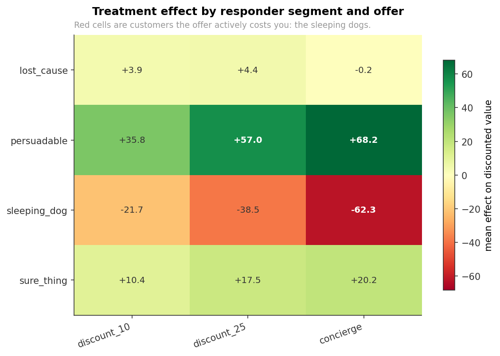
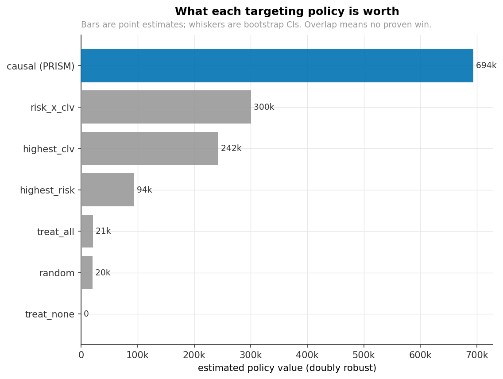
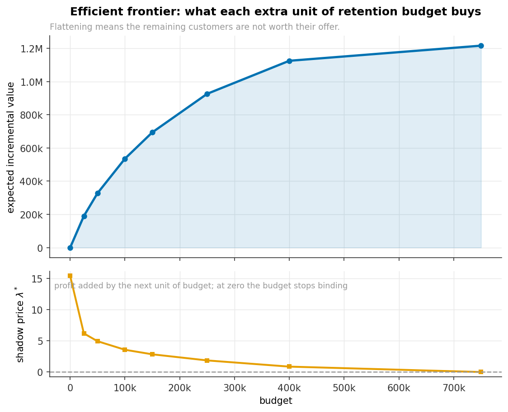
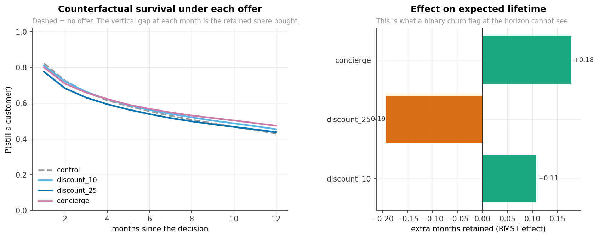
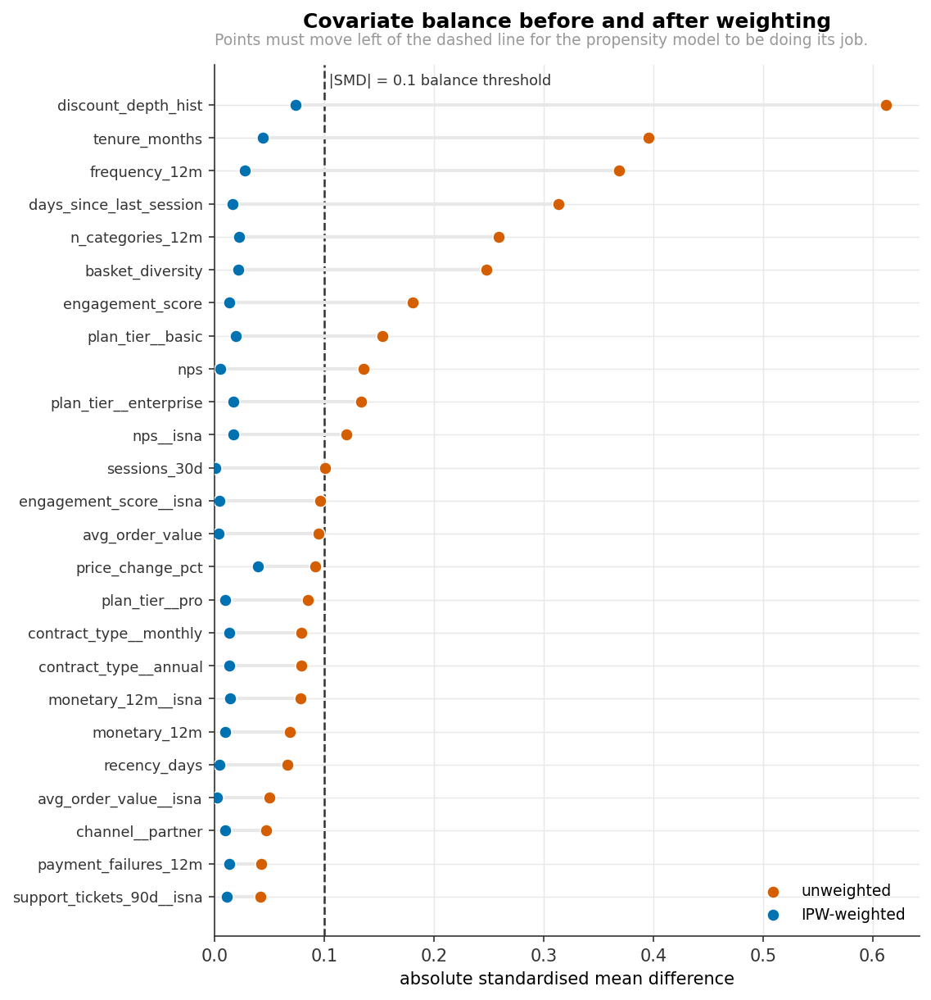

# PRISM — Causal Survival Uplift for Retention

**Prescriptive Retention Intelligence & Spend Management.**

> Most churn projects predict *who will leave*. That is the wrong question.
> PRISM answers the one a business actually pays for: **who will stay *because* you intervened,
> how much extra *lifetime* does each intervention buy, and how should a fixed budget be split
> across competing offers to maximise incremental profit?**

[](https://github.com/UDKARAN5684/PRISM/actions)


---

## Why churn prediction is the wrong objective

Split customers by how they *respond to being contacted*, not by how likely they are to leave:

| segment | churns if left alone? | churns if treated? | worth targeting? |
| --- | --- | --- | --- |
| **persuadable** | yes | no | **yes — the only group that pays** |
| sure thing | no | no | no — wasted spend |
| lost cause | yes | yes | no — wasted spend |
| **sleeping dog** | no | **yes** | **no — targeting them destroys value** |

A churn model ranks persuadables and lost causes together, because both look risky. It cannot see
sleeping dogs at all. Measured effect of each offer on 12-month discounted margin, by segment
(these are the simulator's *known* counterfactuals):

| segment | `discount_10` | `discount_25` | `concierge` |
| --- | ---: | ---: | ---: |
| **persuadable** | +35.8 | +57.0 | **+68.2** |
| sure thing | +10.4 | +17.5 | +20.2 |
| lost cause | +3.9 | +4.4 | −0.2 |
| **sleeping dog** | −21.7 | −38.5 | **−62.3** |

Sleeping dogs are 18% of the base and are actively harmed by contact. That is why a causal policy
beats a risk-ranked one — and PRISM measures the gap in currency rather than asserting it.



*Red cells are customers the offer actively costs you. A churn model cannot see them.*

---

## Headline results

`configs/default.yaml` · 60,000 customers · 24 months · **738,249 panel rows** · seed 7 ·
end-to-end in **11.3 minutes** on 8 CPU cores. Every number below is reproduced by
`python -m prism.pipelines.run_all --config configs/default.yaml --steps all`.

### 1. The naive answer is wrong — and on one offer, wrong in sign

| offer | true effect | naive difference in means | **PRISM estimate** |
| --- | ---: | ---: | ---: |
| `discount_10` | +13.70 | **−18.60** ← wrong sign | **+8.85** |
| `discount_25` | +22.02 | +15.64 | **+11.99** |
| `concierge` | +19.99 | +125.23 | **+14.49** |

Mean absolute error: **naive 47.97 → PRISM 6.80**, i.e. **86% of the confounding bias removed**.

### 2. The estimator recovers effects it can be graded against

| metric | value | reference |
| --- | ---: | --- |
| PEHE (best learner: causal forest) | **58.21** | beats the constant-effect baseline of 61.44 |
| ε_ATE | **6.80** | vs 47.97 for the naive estimator |
| Rank correlation with the true effect | **+0.336** | Spearman, on held-out periods |
| Survival C-index | **0.731** | discrimination of the hazard model |
| Covariate balance, mean \|SMD\| | 0.072 → **0.0099** | after IPW; target < 0.10 |
| Effective sample size | 48,475 | 42% of nominal — the honest denominator |

Full leaderboard (`artifacts/reports/leaderboard.csv`):

| learner | PEHE ↓ | ε_ATE ↓ | rank corr ↑ | fit (s) |
| --- | ---: | ---: | ---: | ---: |
| **causal forest** | **58.21** | 6.80 | 0.336 | 16.3 |
| S-learner | 59.70 | 11.06 | 0.294 | 4.8 |
| **Causal Survival Uplift** | 67.23 | 13.85 | **0.371** | 28.3 |
| R-learner | 67.78 | **6.36** | 0.287 | 8.5 |
| X-learner | 74.00 | 7.10 | 0.251 | 25.4 |
| DR-learner | 96.09 | 7.49 | 0.227 | 8.6 |
| T-learner | 123.88 | 10.77 | 0.185 | 8.4 |

### 3. The money

| policy | expected incremental value | customers treated | ROI |
| --- | ---: | ---: | ---: |
| **causal (PRISM)** | **693,927** | 11,043 | **4.6×** |
| risk × CLV | 300,267 | 20,161 | 2.0× |
| highest CLV | 242,286 | 20,161 | 1.6× |
| **highest churn risk** *(the conventional model)* | **94,012** | 20,161 | 0.6× |
| treat everyone | 21,075 | 20,161 | 0.1× |
| random | 20,163 | 20,161 | 0.1× |
| do nothing | 0 | 0 | — |

Same 150,000 budget in every row. The causal policy is worth **7.4× the conventional
churn-model policy** while contacting **half as many customers** — it spends more per customer, on
the right ones.

The Lagrangian shadow price at this budget is **λ\* = 2.84**. Because net value is already net of
offer cost, that means each *additional* unit of budget would add another 2.84 in incremental
profit — the programme is under-funded, not over-funded. That single number is what settles a
budget conversation, and a greedy ranking cannot produce it.





*Left to right: what each targeting rule is worth with bootstrap confidence intervals, and what each additional unit of budget buys.*

It captures **39.6%** of what a perfectly-informed oracle could achieve.

---

## The distinctive part: Causal Survival Uplift

Conventional uplift modelling asks *"does the offer change the probability of a binary event?"*.
That discards **when** churn happens, so an offer that delays churn by three months but does not
prevent it scores **zero** against a 12-month churn flag — even though three months of margin is
real money.

PRISM estimates treatment effects on **restricted mean survival time** and on **discounted lifetime
value**, under right-censoring, across multiple arms:

```text
  1. censoring model        G(t|x)  -> IPCW weights (right-censoring handled, not dropped)
  2. per-arm hazard         h_a(t|x) = sigmoid( f_a(x) + alpha_t )
  3. counterfactual curves  S_a(k|x) = prod_{j<k} ( 1 - h_a(j|x) )
  4. contrasts
       tau_rmst_a(x)  = sum_k [ S_a(k|x) - S_0(k|x) ]                        -> months
       tau_value_a(x) = sum_k [ S_a(k|x) - S_0(k|x) ] * m(x) * (1+d)^(-k)    -> currency
  5. doubly-robust IPCW-AIPW correction, cross-fitted
       consistent if EITHER the hazard model OR the propensity model is right
```

`tau_value` is denominated in money, so it drops straight into the budget optimiser. No causal-ML
library ships this estimator; it is implemented in
[`prism/causal/survival_uplift.py`](prism/causal/survival_uplift.py). It has the **best rank
correlation with the true effect (+0.371)** of any learner in the leaderboard.



*Left: retention curves under each offer. Right: the extra months each offer buys — the quantity a binary churn flag at the horizon cannot see.*

---

## The decision loop

```text
   event log + panel
          |
          v
  [ point-in-time features ]  as-of joins, leakage guard, embargoed temporal split
          |
          +---> [ survival ]   h(t|x) -> S(t|x) -> RMST          discrete-time hazard / Cox / RSF
          +---> [ CLV ]        BG/NBD + Gamma-Gamma, DeepCLV
          +---> [ propensity ] e_a(x), overlap + balance diagnostics
          |
          v
  [ CAUSAL SURVIVAL UPLIFT ]   tau_rmst_a(x), tau_value_a(x)     S/T/X/DR/R + causal forest
          |
          v
  [ unit economics ]           net_ia = tau_value_a(x) - cost_a * redemption_a
          |
          v
  [ budget-constrained assignment ]   multiple-choice knapsack
          |                            greedy | Lagrangian dual | LP relaxation
          |                            lambda* = marginal return on the next unit of budget
          v
  [ off-policy evaluation ]    DR policy value + bootstrap CIs vs 6 baselines
  [ refutation ]               placebo, common cause, subset, E-value, Austen contour
  [ fairness audit ]           parity gaps + the priced cost of enforcing parity
  [ monitoring ]               PSI/KS drift + CATE sign-flip and decile migration
```

---

## Quickstart

```bash
git clone https://github.com/UDKARAN5684/PRISM.git && cd PRISM
pip install -r requirements.txt
pip install -e .

# reduced scale (~4 min) - start here
python -m prism.pipelines.run_all --config configs/fast.yaml --steps all

# full scale, the numbers above (~11 min)
python -m prism.pipelines.run_all --config configs/default.yaml --steps all
```

Then:

```bash
make dashboard   # Streamlit policy simulator on :8501
make api         # FastAPI scoring service on :8000  (docs at /docs)
make mlflow      # experiment tracking on :5000
make test        # the full test suite
make smoke       # every module's built-in self test
docker compose up --build        # all three services at once
```

Results land in `artifacts/reports/` (22 tables, metrics, model card, decision memo) and
`docs/figures/` (12 charts). A narrative walkthrough is in
[`notebooks/01_why_churn_prediction_is_the_wrong_question.ipynb`](notebooks/01_why_churn_prediction_is_the_wrong_question.ipynb).

Only `numpy pandas scipy scikit-learn statsmodels matplotlib pyarrow` are hard requirements.
LightGBM, torch, DuckDB, SHAP, MLflow and lifelines are all optional — each is probed at import
(without being imported) and substituted if absent, so the pipeline runs on a bare environment.

---

## What is in here

47 modules, ~46,000 lines. Every module has a built-in self-test (`make smoke`).

| layer | module | what it does |
| --- | --- | --- |
| **data** | [`dgp.py`](prism/data/dgp.py) | ground-truth simulator: 4 responder segments, confounded multi-arm assignment, a hidden confounder, drift, and **analytically exact counterfactuals** |
| | [`messy.py`](prism/data/messy.py) | MAR/MNAR missingness, outliers, duplicates, categorical dirt, a mid-stream column rename — and the cleaner that repairs it |
| | [`features.py`](prism/data/features.py) | point-in-time feature store, as-of joins, `assert_no_leakage`, embargoed temporal split |
| | [`warehouse.py`](prism/data/warehouse.py) | DuckDB medallion (bronze/silver/gold) with content hashing and lineage |
| | [`real.py`](prism/data/real.py) | adapters for IBM Telco, UCI Online Retail II and the **Hillstrom randomised e-mail experiment** |
| **models** | [`survival.py`](prism/models/survival.py) | discrete-time hazard (torch), Cox PH with Efron ties and an analytic gradient, random survival forest, IPCW Brier, time-dependent AUC |
| | [`clv.py`](prism/models/clv.py) | BG/NBD and Gamma-Gamma fitted by MLE from scratch, plus a deep CLV head |
| | [`propensity.py`](prism/models/propensity.py) | cross-fitted multi-arm generalised propensity, overlap tables, SMD love plots, ESS |
| **causal** | [`learners.py`](prism/causal/learners.py) | S / T / X / DR / R learners with honest cross-fitting |
| | [`forest.py`](prism/causal/forest.py) | honest causal forest: local centering, subsampling without replacement, ratio-of-sums leaves |
| | [`survival_uplift.py`](prism/causal/survival_uplift.py) | **the differentiator** — CATE on RMST and discounted value under censoring |
| | [`evaluate.py`](prism/causal/evaluate.py) | Qini, AUUC, PEHE, GATES, BLP calibration, TOC, DR policy value |
| | [`refute.py`](prism/causal/refute.py) | placebo, random common cause, subset, E-value, Rosenbaum bounds, Austen contour |
| **decision** | [`economics.py`](prism/decision/economics.py) | effect → money, including redemption-adjusted cost and per-arm breakeven |
| | [`optimize.py`](prism/decision/optimize.py) | multiple-choice knapsack: greedy, Lagrangian dual, LP relaxation, efficient frontier |
| | [`policy_eval.py`](prism/decision/policy_eval.py) | IPW / SNIPW / DR off-policy value, paired bootstrap CIs, oracle gap |
| | [`fairness.py`](prism/decision/fairness.py) | parity audit and the **priced** cost of enforcing parity |
| **monitoring** | [`drift.py`](prism/monitoring/drift.py) | PSI/KS/JS, and **CATE-specific** monitoring: sign-flip rate and decile migration |
| **serving** | [`api.py`](prism/serving/api.py) | FastAPI `/score`, `/policy`, `/explain`, `/metrics`, `/health`, `/reload` |

---

## How the claims are validated

Most portfolio projects cannot check a causal model, because on real data `τᵢ` is never observed.
PRISM's simulator computes counterfactual survival and value under every arm **analytically from
the hazard path**, so the estimator can be graded against truth: PEHE, ε_ATE and policy regret
against an oracle.

**CI enforces the science, not just the code.** `scripts/check_metrics.py` runs after every
pipeline build and fails the job if any headline claim stops holding — currently **16/16 checks
pass**, including *PEHE must beat a constant-effect baseline*, *the adjusted estimate must beat the
naive one*, *the causal policy must beat risk targeting*, and *no point-in-time leakage*.

Also verified: Cox coefficients against `lifelines` (to 1e-5) and a numerical gradient
(`scipy.check_grad`); IPCW weights using `G(T−)` not `G(T)`; the point-in-time join against a
brute-force reference; the knapsack solvers against exhaustive enumeration on small instances; and
the off-policy estimators against a synthetic bandit with a known value.



*Every covariate moves inside the 0.1 balance threshold after inverse-propensity weighting — the check that the propensity model actually removed the selection.*

Robustness (`artifacts/reports/refutation.csv`): **6 of 8** refutation tests pass. Permuting
treatment destroys the effect; adding an irrelevant covariate moves the estimate by 4.4% against a
10% tolerance; re-estimating on random subsets is stable.

### Two things ground truth caught that nothing else would have

Both are written up in [`docs/DECISIONS.md`](docs/DECISIONS.md) (ADR-013, ADR-014):

1. **An estimand mismatch.** The simulator originally re-drew each customer's offer every month,
   while the ground truth was defined as one *sustained* offer. Those are different quantities, and
   the mismatch dragged every estimate to approximately **zero** against a true effect of +14 to
   +22. Not a modelling bug, a tuning problem, or a sample-size problem — the models were being
   graded against something the data could not express. On real data the honest reading would have
   been "retention offers don't work", and it would have been wrong.

2. **An uncalibrated confounder.** The hidden confounder's strength was set by eye at `0.35`. At
   that level the induced bias is *larger than the effect it perturbs*, and the estimated ranking
   **inverts** rather than merely degrading. It is now calibrated to `0.05`, and the broken regime
   ships as [`configs/high_confounding.yaml`](configs/high_confounding.yaml) so you can run it and
   watch the method fail on purpose.

Knowing where a method breaks is worth more than a benchmark tuned until it always wins.

---

## Honest limitations

Stated plainly, because a reviewer will find them anyway.

- **PEHE beats the baseline, but not by much** (58.21 vs 61.44, ~5%). Individual-effect estimation
  is genuinely hard here: the treatment effect has a standard deviation of ~30 against outcome noise
  an order of magnitude larger. The *ranking* carries real signal (+0.34), which is what targeting
  needs, and the aggregate effects are recovered well (ε_ATE 6.8 vs 48.0 naive) — but PRISM does not
  produce well-calibrated individual effect estimates, and the reports say so.
- **Qini and AUUC are near zero** in the leaderboard. That is expected and not a bug: the classical
  uplift curve is only identified under randomisation, and it is being computed on confounded
  observational test data. This is precisely why the project leads with ground-truth metrics and
  doubly-robust policy value instead.
- **30% CATE sign-flip rate** between periods. Nearly a third of customers would have their
  treat/do-not-treat decision reversed as the model is refreshed. The monitoring layer flags it;
  in production this would warrant a stability constraint before acting.
- **No interference.** Customers are independent; real discounts leak between them. SUTVA is the
  least defensible assumption here.
- **Simulated primary data.** Mitigated, not eliminated, by the real-data track (Hillstrom is a
  genuine randomised three-arm experiment).
- **Frozen-covariate counterfactuals** and **static rather than dynamic** treatment regimes — see
  [`docs/METHODOLOGY.md`](docs/METHODOLOGY.md) §8.

---

## Documentation

- [`SPEC.md`](SPEC.md) — the interface contract every module was built against
- [`SPEC_PERF.md`](SPEC_PERF.md) — the performance contract (runtime budgets, required algorithms)
- [`docs/METHODOLOGY.md`](docs/METHODOLOGY.md) — estimands, identification, estimators, evaluation, sensitivity
- [`docs/DECISIONS.md`](docs/DECISIONS.md) — 14 architecture decision records, with the rejected alternatives
- `artifacts/reports/model_card.md` — generated model card
- `artifacts/reports/decision_memo.md` — generated one-page memo for a non-technical reader

## Key references

Wager & Athey (2018); Athey, Tibshirani & Wager (2019) — causal forests · Künzel et al. (2019) —
metalearners · Nie & Wager (2021) — R-learner · Chernozhukov et al. (2018) — DML and GATES ·
Robins, Rotnitzky & Zhao (1994) — IPCW · VanderWeele & Ding (2017) — E-values ·
Cinelli & Hazlett (2020) — sensitivity contours · Fader, Hardie & Lee (2005) — BG/NBD.

Full list in [`docs/METHODOLOGY.md`](docs/METHODOLOGY.md#9-references).

---

MIT licensed. Built as a demonstration of end-to-end causal ML: from a messy event log to a
budget-constrained decision, with the statistics checked rather than assumed.
